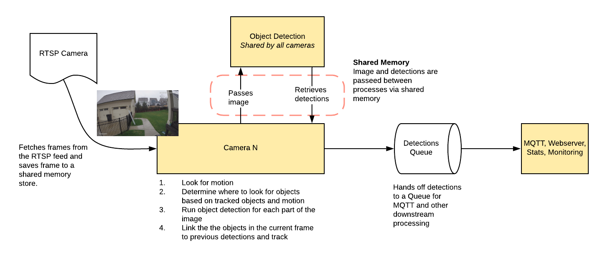

# Frigate - Realtime Object Detection for RTSP Cameras
Uses OpenCV and Tensorflow to perform realtime object detection locally for RTSP cameras. Designed for integration with HomeAssistant or others via MQTT.

- Leverages multiprocessing and threads heavily with an emphasis on realtime over processing every frame
- Allows you to define specific regions (squares) in the image to look for motion/objects
- Motion detection runs in a separate process per region and signals to object detection to avoid wasting CPU cycles looking for objects when there is no motion
- Object detection with Tensorflow runs in a separate process per region
- Detected objects are placed on a shared mp.Queue and aggregated into a list of recently detected objects in a separate thread
- A person score is calculated as the sum of all scores/5
- Motion and object info is published over MQTT for integration into HomeAssistant or others
- An endpoint is available to view an MJPEG stream for debugging



## Example video
You see multiple bounding boxes because it draws bounding boxes from all frames in the past 1 second where a person was detected. Not all of the bounding boxes were from the current frame.
[](http://www.youtube.com/watch?v=nqHbCtyo4dY "Frigate")

## Getting Started
Build the container with
```
docker build -t frigate .
```

Download a model from the [zoo](https://github.com/tensorflow/models/blob/master/research/object_detection/g3doc/detection_model_zoo.md).

Download the cooresponding label map from [here](https://github.com/tensorflow/models/tree/master/research/object_detection/data).

Run the container with
```
docker run --rm \
-v <path_to_frozen_detection_graph.pb>:/frozen_inference_graph.pb:ro \
-v <path_to_labelmap.pbtext>:/label_map.pbtext:ro \
-p 5000:5000 \
-e RTSP_URL='<rtsp_url>' \
-e REGIONS='<box_size_1>,<x_offset_1>,<y_offset_1>,<min_person_size_1>,<min_motion_size_1>,<mask_file_1>:<box_size_2>,<x_offset_2>,<y_offset_2>,<min_person_size_2>,<min_motion_size_2>,<mask_file_2>' \
-e MQTT_HOST='your.mqtthost.com' \
-e MQTT_TOPIC_PREFIX='cameras/1' \
-e DEBUG='0' \
frigate:latest
```

Example docker-compose:
```
  frigate:
    container_name: frigate
    restart: unless-stopped
    image: frigate:latest
    volumes:
      - <path_to_frozen_detection_graph.pb>:/frozen_inference_graph.pb:ro
      - <path_to_labelmap.pbtext>:/label_map.pbtext:ro
      - <path_to_config>:/config
    ports:
      - "127.0.0.1:5000:5000"
    environment:
      RTSP_URL: "<rtsp_url>"
      REGIONS: "<box_size_1>,<x_offset_1>,<y_offset_1>,<min_person_size_1>,<min_motion_size_1>,<mask_file_1>:<box_size_2>,<x_offset_2>,<y_offset_2>,<min_person_size_2>,<min_motion_size_2>,<mask_file_2>"
      MQTT_HOST: "your.mqtthost.com"
      MQTT_TOPIC_PREFIX: "cameras/1"
      DEBUG: "0"
```

Access the mjpeg stream at http://localhost:5000

## Integration with HomeAssistant
```
camera:
  - name: Camera Last Person
    platform: generic
    still_image_url: http://<ip>:5000/best_person.jpg

binary_sensor:
  - name: Camera Motion
    platform: mqtt
    state_topic: "cameras/1/motion"
    device_class: motion
    availability_topic: "cameras/1/available"

sensor:
  - name: Camera Person Score
    platform: mqtt
    state_topic: "cameras/1/objects"
    value_template: '{{ value_json.person }}'
    unit_of_measurement: '%'
    availability_topic: "cameras/1/available"
```

## Tips
- Lower the framerate of the RTSP feed on the camera to reduce the CPU usage for capturing the feed
- Use SSDLite models to reduce CPU usage

## Future improvements
- [ ] Build tensorflow from source for CPU optimizations
- [ ] Add ability to turn detection on and off via MQTT
- [ ] MQTT motion occasionally gets stuck ON
- [ ] Output movie clips of people for notifications, etc.
- [ ] Integrate with homeassistant push camera
- [ ] Merge bounding boxes that span multiple regions
- [ ] Switch to a config file
- [ ] Allow motion regions to be different than object detection regions
- [ ] Implement mode to save labeled objects for training
- [ ] Try and reduce CPU usage by simplifying the tensorflow model to just include the objects we care about
- [ ] Look into GPU accelerated decoding of RTSP stream
- [ ] Send video over a socket and use JSMPEG

## Building Tensorflow from source for CPU optimizations
https://www.tensorflow.org/install/source#docker_linux_builds
used `tensorflow/tensorflow:1.12.0-devel-py3`

## Optimizing the graph (cant say I saw much difference in CPU usage)
https://github.com/tensorflow/tensorflow/blob/master/tensorflow/tools/graph_transforms/README.md#optimizing-for-deployment
```
docker run -it -v ${PWD}:/lab -v ${PWD}/../back_camera_model/models/ssd_mobilenet_v2_coco_2018_03_29/frozen_inference_graph.pb:/frozen_inference_graph.pb:ro tensorflow/tensorflow:1.12.0-devel-py3 bash

bazel build tensorflow/tools/graph_transforms:transform_graph

bazel-bin/tensorflow/tools/graph_transforms/transform_graph \
--in_graph=/frozen_inference_graph.pb \
--out_graph=/lab/optimized_inception_graph.pb \
--inputs='image_tensor' \
--outputs='num_detections,detection_scores,detection_boxes,detection_classes' \
--transforms='
  strip_unused_nodes(type=float, shape="1,300,300,3")
  remove_nodes(op=Identity, op=CheckNumerics)
  fold_constants(ignore_errors=true)
  fold_batch_norms
  fold_old_batch_norms'
```